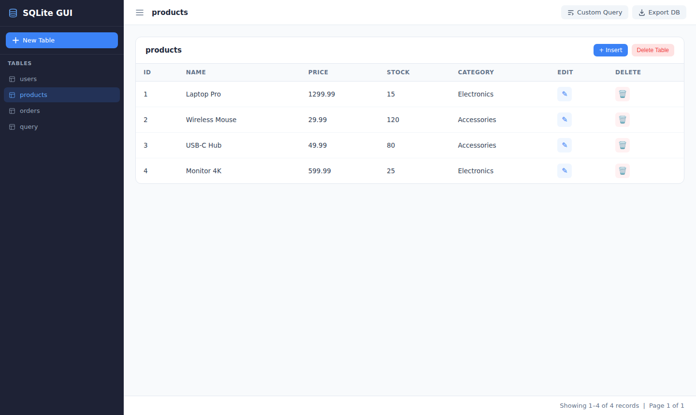
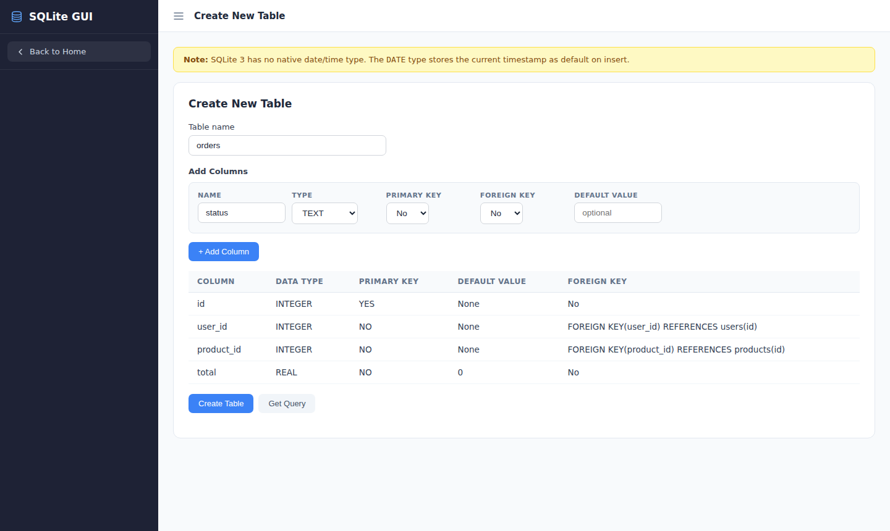
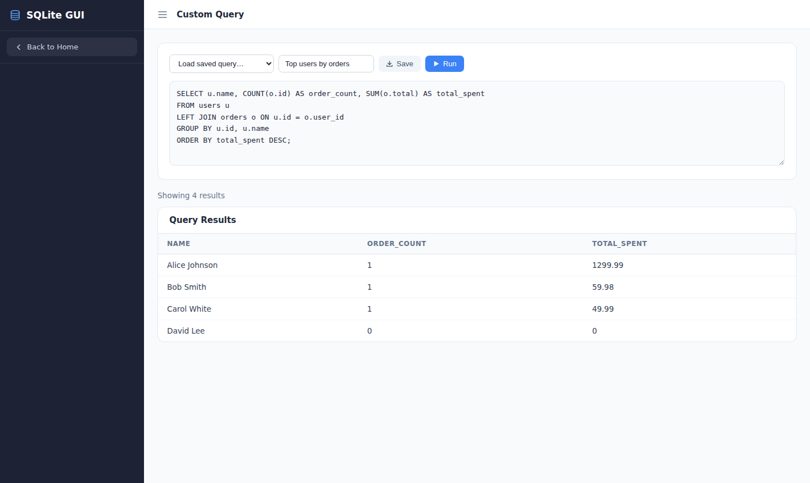
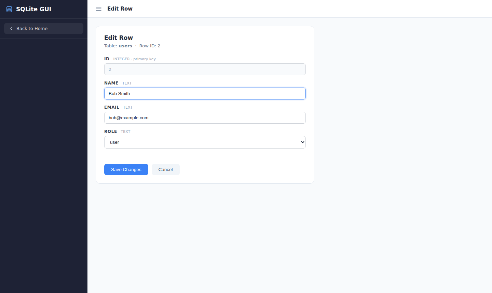

# GUI for Node.js Databases

[](https://www.npmjs.com/package/@nik2208/sqlite-gui-node)
[](https://www.npmjs.com/package/@nik2208/sqlite-gui-node)

[](https://github.com/nik2208/sqlite-gui-node/actions/workflows/ci.yml)
[](https://coveralls.io/github/nik2208/sqlite-gui-node?branch=main)

[](https://nodei.co/npm/nik2208/sqlite-gui-node/)

A modern, dark-themed web GUI for managing your Node.js databases — **SQLite, MySQL/MariaDB and PostgreSQL** — directly from the browser. Schema discovery is performed automatically via database reflection, so no manual configuration is required.

- [Installation](#installation)
- [Using a Custom Port](#using-a-custom-port)
- [Using it as Express Js Middleware](#using-it-as-express-js-middleware)
- [Multi-Database Support](#multi-database-support)
- [Arguments](#arguments)
- [Features](#features)
- [Updating the Package](#updating-the-package)
- [Uninstallation](#uninstallation)
- [Screenshots](#screenshots)

## Installation

To use `sqlite-gui-node`, you need to have Node.js installed on your machine. You can download Node.js from [nodejs.org](https://nodejs.org/en).

### Step 1: Install the Package

```
$ npm install @nik2208/sqlite-gui-node
```

### Step 2: Import and Initialize

After installing the package, import it in your server's entry file.

```js
const express = require("express");
// import the SQLite DB that you use
const sqlite3 = require("sqlite3").verbose();
const db = new sqlite3.Database("app.db");
// Import the package
const { SqliteGuiNode } = require("sqlite-gui-node");

const app = express();

// start the GUI (default port 8080)
SqliteGuiNode(db).catch((err) => {
  console.error("Error starting the GUI:", err);
});

app.listen(4000);
```

### Step 3: Access the GUI

Once the GUI is started, open your browser and navigate to **http://localhost:8080/home** to start managing your database.

## Using a Custom Port

```js
// Pass the port as the second argument
SqliteGuiNode(db, 3005).catch((err) => {
  console.error("Error starting the server:", err);
});
```

## Using it as Express Js Middleware

If you want to mount the GUI inside the same Express app, use `SqliteGuiNodeMiddleware`:

```js
const express = require("express");
const sqlite3 = require("sqlite3").verbose();
const db = new sqlite3.Database("app.db");
const { SqliteGuiNodeMiddleware } = require("sqlite-gui-node");

const app = express();
app.use(SqliteGuiNodeMiddleware(app, db));

app.listen(4000);
```

You can also use `createSqliteGuiApp` to mount the GUI on a sub-path:

```js
const sqlite3 = require('sqlite3').verbose();
const { createSqliteGuiApp } = require('sqlite-gui-node');
const express = require('express');

const app = express();
const db = new sqlite3.Database('app.db');

const sqliteGuiApp = await createSqliteGuiApp(db);
app.use('/sqlite', sqliteGuiApp);
// Dashboard: http://localhost:4000/sqlite/home
```

## Multi-Database Support

> **mysql2** and **pg** are optional dependencies — install only the driver you need.

The library ships with a pluggable adapter layer. Each adapter uses **database reflection** (`information_schema` / `PRAGMA`) to discover tables and columns at runtime, so no manual schema definition is required.

### MySQL / MariaDB

```
$ npm install mysql2
```

```js
const mysql = require("mysql2/promise");
const { MysqlAdapter, SqliteGuiNodeWithAdapter } = require("sqlite-gui-node");

const pool = mysql.createPool({
  host: "localhost",
  user: "root",
  password: "secret",
  database: "mydb",
});

SqliteGuiNodeWithAdapter(new MysqlAdapter(pool), 8080);
```

### PostgreSQL

```
$ npm install pg
```

```js
const { Pool } = require("pg");
const { PostgresAdapter, SqliteGuiNodeWithAdapter } = require("sqlite-gui-node");

const pool = new Pool({
  host: "localhost",
  user: "postgres",
  password: "secret",
  database: "mydb",
});

SqliteGuiNodeWithAdapter(new PostgresAdapter(pool), 8080);
```

### Bring your own adapter

Implement the `IDatabaseAdapter` interface to add support for any other data source:

```ts
import type { IDatabaseAdapter } from "sqlite-gui-node";

class MyCustomAdapter implements IDatabaseAdapter {
  // implement all interface methods …
}
```

## Arguments

### `SqliteGuiNode(db, port?)` / `SqliteGuiNodeWithAdapter(adapter, port?)`

| Argument | Type                              | Description                                                              |
| -------- | --------------------------------- | ------------------------------------------------------------------------ |
| db       | `sqlite3.Database`                | Your SQLite database instance (legacy API).                              |
| adapter  | `IDatabaseAdapter`                | A database adapter (SQLite, MySQL, PostgreSQL, or custom).               |
| port     | `number`                          | (Optional) Port for the GUI server. Default is `8080`.                   |

## Features

### 1. CRUD Operations

Perform Create, Read, Update, and Delete operations on your database tables with ease.

- **Create**: Add new records via auto-generated forms.
- **Read**: Browse paginated table data in a clean data grid.
- **Update**: Edit existing records field by field.
- **Delete**: Remove rows or entire tables.

### 2. Write Custom Queries

Write and execute any SQL statement directly from the built-in query editor — SELECT, INSERT, UPDATE, DELETE, CREATE, and more.

### 3. Save Custom Queries

Save your frequently used queries for quick access and reuse.

### 4. Generate Query Code Using GUI

Generate INSERT / UPDATE / CREATE TABLE SQL from the GUI without writing a single line of SQL.

### 5. Export Database

Export the entire database schema and data to a `.sql` file with one click.

### 6. Multi-Database Support

Connect to **SQLite**, **MySQL/MariaDB**, or **PostgreSQL** using the adapter-based API. Schema introspection is automatic — no manual table mapping needed.

## Updating the Package

```
$ npm update sqlite-gui-node
```

## Uninstallation

```
$ npm uninstall sqlite-gui-node
```

## Screenshots






## Troubleshooting

If you encounter any issues during installation or usage, please refer to the [Issues](https://github.com/nik2208/sqlite-gui/issues) section on GitHub.

## License

The MIT License © 2026.

---

Improved with ♥ by [NiK](https://github.com/nik2208)
